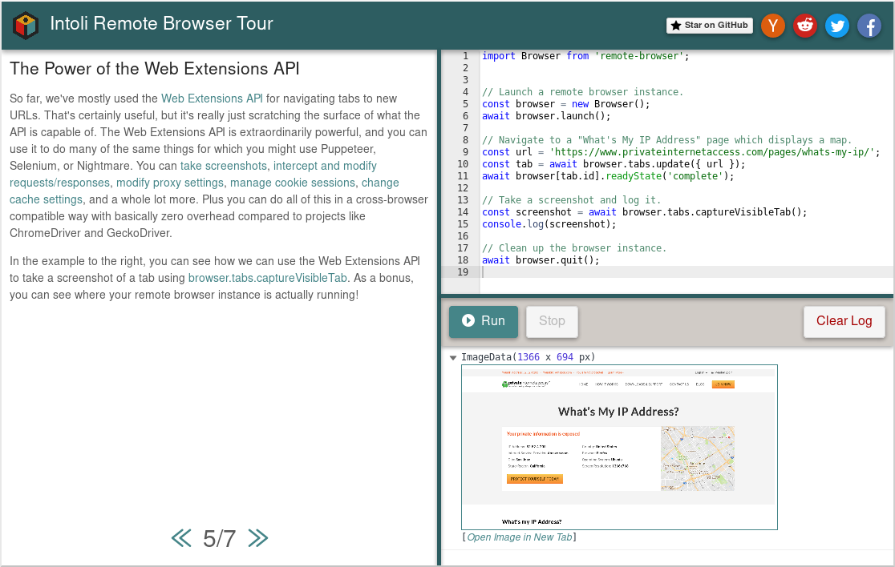

<h1 vertical-align="middle">Remote Browser
    <a targe="_blank" href="https://twitter.com/home?status=Remote%20Browser%20%E2%80%93%20A%20browser%20automation%20framework%20based%20on%20the%20Web%20Extensions%20API.%20%40IntoliNow%0A%0Ahttps%3A//github.com/intoli/remote-browser">
        </a>
    <a target="_blank" href="https://www.facebook.com/sharer/sharer.php?u=https%3A//github.com/intoli/remote-browser">
        </a>
    <a target="_blank" href="http://reddit.com/submit?url=https%3A%2F%2Fgithub.com%2Fintoli%2Fremote-browser&title=Remote%20Browser%20%E2%80%93%20A%20browser%20automation%20framework%20based%20on%20the%20Web%20Extensions%20API.">
        </a>
    <a target="_blank" href="https://news.ycombinator.com/submitlink?u=https://github.com/intoli/remote-browser&t=Remote%20Browser%20%E2%80%93%20A%20browser%20automation%20framework%20based%20on%20the%20Web%20Extensions%20API.">
        </a>
</h1>

<p align="left">
    <a href="https://circleci.com/gh/intoli/remote-browser/tree/master">
        </a>
    <a href="https://github.com/intoli/remote-browser/blob/master/LICENSE">
        </a>
    <a href="https://www.npmjs.com/package/remote-browser">
        </a>
</p>


Remote Browser is a library for controlling web browsers like Chrome and Firefox programmatically using JavaScript.
You've likely heard of similar browser automation frameworks before, such as [Puppeteer](https://github.com/GoogleChrome/puppeteer) and [Selenium](https://github.com/SeleniumHQ/selenium).
Much like these other projects, Remote Browser can be used to accomplish a wide variety of tasks relating to UI testing, Server Side Rendering (SSR), and web scraping.
What makes Remote Browser different from these other libraries is that it's built using standard cross-browser compatible technologies, and its primary goal is to facilitate interactions with existing APIs rather than to create a new one of its own.

Remote Browser provides a minimalistic and lightweight framework for automating browsers using vanilla [JavaScript](https://tc39.github.io/ecma262/), [HTML browsing contexts](https://html.spec.whatwg.org/multipage/window-object.html#the-window-object), and the [Web Extensions API](https://developer.mozilla.org/en-US/Add-ons/WebExtensions).
If you're already familiar with these technologies, then you already know almost everything that you need to use Remote Browser.
If not, then there are vast learning resources out there, like [The Mozilla Developer Network (MDN)](https://developer.mozilla.org/en-US/docs/Web), which can get you up to speed in no time.
Be sure to check out the [Introduction](#introduction), the [Interactive Tour](https://intoli.com/tour), and [Usage Examples](#usage-examples) to learn about how Remote Browser makes it easy to use these technologies.


## Table of Contents

- [Introduction](#introduction) - A detailed explanation of what Remote Browser is and the core concepts behind the project.
- [Interactive Tour](#interactive-tour)
- [Installation](#installation) - Instructions for installing Remote Browser.
- [Usage Examples](#usage-examples) - Illustrative examples of how Remote Browser can be used.
- [Development](#development) - Instructions for setting up the development environment.
- [Contributing](#contributing) - Guidelines for contributing.
- [License](#license) - License details for the project.


## Introduction

The core technology that makes Remote Browser possible is the [Web Extensions API](https://developer.mozilla.org/en-US/Add-ons/WebExtensions).
This API is what allows third party browser addons to extend and modify the capabilities of browsers such as Firefox, Chrome, Edge, and Opera.
If you've never written a browser extension before, then you might be surprised at just how powerful this API is.
Creating tabs and interacting with pages is just the beginning; it's also possible to [intercept and modify network requests/responses](https://developer.mozilla.org/en-US/Add-ons/WebExtensions/API/webRequest), [create and control containerized sessions within a single browser instance](https://developer.mozilla.org/en-US/Add-ons/WebExtensions/API/contextualIdentities), [take screenshots](https://developer.mozilla.org/en-US/Add-ons/WebExtensions/API/tabs/captureVisibleTab), and [*much* more](https://developer.mozilla.org/en-US/Add-ons/WebExtensions/API).
The central idea behind Remote Browser is that there's no need to reinvent the wheel when modern browsers *already* ship with an extremely powerful cross-browser compatible API that's suitable for automation tasks.

Let's take a look at a quick example of how you would navigate to a tab and take a screenshot using Remote Browser.

```javascript
import Browser from 'remote-browser';

(async () => {
  // Create and launch a new browser instance.
  const browser = new Browser();
  await browser.launch();

  // Directly access the Web Extensions API from a remote client.
  const tab = await browser.tabs.create({ url: 'https://intoli.com' });
  const screenshot = await browser.tabs.captureVisibleTab();
})();
```

On the surface, this probably looks pretty similar to examples from other browser automation frameworks.
The difference is that [browser.tabs.create()](https://developer.mozilla.org/en-US/Add-ons/WebExtensions/API/tabs/create) and [browser.tabs.captureVisibleTab](https://developer.mozilla.org/en-US/Add-ons/WebExtensions/API/tabs/captureVisibleTab) aren't part of the Remote Browser API; they're part of the Web Extensions API.

In a web extension, you would typically interact with the Web Extensions API through a global `browser` object.
You could make a call to `browser.tabs.create()` in your extension's [background script](https://developer.mozilla.org/en-US/Add-ons/WebExtensions/manifest.json/background), and it would create a new tab.
Remote Browser lets you make this call from the environment where you're running your browser control code as though you were inside of an extension.
The following three calls are actually all exactly equivalent with Remote Browser.

```javascript
// Very explicit, we're specifying a function and argument to evaluate in the background page.
await browser.evaluateInBackground(createProperties => (
  browser.tabs.create(createProperties)
), { url: 'https://intoli.com' });

// A bit of syntactic sugar, we can omit ".evaluateInBackground" and the same thing happens.
await browser(createProperties => (
  browser.tabs.create(createProperties)
), { url: 'https://intoli.com' });

// A lot of syntactic sugar, the function and explicit argument get constructed automatically.
await browser.tabs.create({ url: 'https://intoli.com' });
```

It's mostly immediately clear what's really happening here with the the first `browser.evaluateInBackground()` call.
A function and it's argument are being transmitted to the background script context of a web extension where they're evaluated.
The next two calls just rip out successive layers of boilerplate, but they're doing the exact same thing.

Similarly, we can evaluate code in the context of a tab in the browser.
The syntax here is very similar to how we evaluate code in the background script, we just need to additionally specify which tab we're interested in.
The following two calls are also exactly equivalent.

```javascript
// Evaluate the function in the content script context for the identified by `tab.id`.
await browser.evaluateInContent(tab.id, () => (
  document.innerHTML = 'hi!';
));

// A shorthand for first accessing a specific tab, and then evaluating code in it.
await browser[tab.id](() => document.body.innerHTML = 'hi!');
```

At this point, you've seen nearly all of the syntax that Remote Browser provides.
It makes it really easy to evaluate code in different contexts, and lets you use the browser APIs to control and interact with the browser itself.


## Interactive Tour


<p align="center">
    <a alt="A Screenshot of the Tour" href="https://intoli.com/tour">
        
    </a>
</p>

You can learn more about how Remote Browser works in [the interactive tour](https://intoli.com/tour).
The tour provides an interactive environment where you can run code examples in your browser without needing to install any software.
It expands upon some of the fundamental concepts behind Remote Browser, and demonstrates how the library can be used in real-world scenarios.


## Usage Examples

### Connecting to a Running Browser

All of the browser control code for Remote Browser is implemented as a cross-browser compatible web extension.
When you execute `Browser.launch()`, it simply runs a browser instance with the extension installed and passes it the parameters necessary to connect to the remote client.
You can also install this same extension in your day-to-day browser, and tell it to connect to a remote client manually.
This can be a very useful debugging tool while you're developing scripts, or as a means to quickly automate simple tasks without needing to create a whole browser extension from scratch.

Calling `Browser.listen()` on a new browser instance will cause it to listen on an open port for a connection from an already running browser.
It will return the port that it's listening on, and wait for you to initialize a connection from a browser that has the Remote Browser extension installed.

```javascript
const browser = new Browser();
const port = await browser.listen();
console.log(`Listening on port: ${port}`);
```

The connection can be initiated from within the browser using the Remote Browser extension popup.
Here's an example of the connection process.


The browser interactions that we do in this video aren't particularly useful, but you have the full power of Remote Browser at your fingertips once you're connected.
You could, for instance, use [web extension alarms](https://developer.mozilla.org/en-US/Add-ons/WebExtensions/API/alarms) to schedule arbitrary tasks to run in the browser at specified times or intervals.
These tasks would be scheduled within the browser itself, so you could configure code to run even after the client has disconnected.


## Installation

Remote Browser is available as an [npm package](https://www.npmjs.com/package/remote-browser), and the latest version can be installed by running the following.

```bash
yarn add remote-browser
```

It's possible to use Remote Browser as a client for browser sessions on remote servers, but you'll almost certainly want a local browser installed when you're first getting started.
We recommend [installing Firefox](https://www.mozilla.org/firefox), even if it's not your day-to-day browser, because it has a more complete implementation of the Web Extensions API than other browsers.
It's additionally set as the default in Remote Browser, so it will allow you to run the usage examples without changing any of the configuration options.


## Development

To get started on development, you simply need to clone the repository and install the project dependencies.

```bash
# Clone the repository.
git clone https://github.com/intoli/remote-browser.git
cd remote-browser

# Install the dependencies.
yarn install

# Build the project.
yarn build

# Run the tests.
yarn test
```

## Contributing

Contributions are welcome, but please follow these contributor guidelines outlined in [CONTRIBUTING.md](CONTRIBUTING.md).


## License

Remote Browser is licensed under a [BSD 2-Clause License](LICENSE) and is copyright [Intoli, LLC](https://intoli.com).
